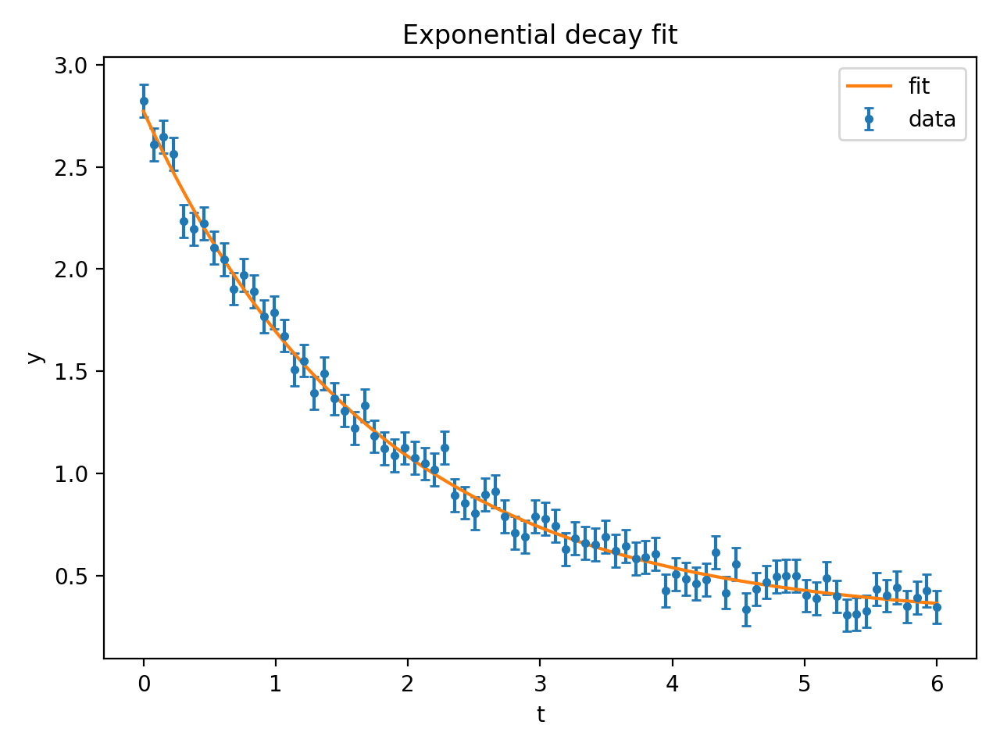

# scientific-python-toolkit (satool)

A small scientific Python toolkit demo: generate synthetic physics-like data, fit an exponential decay model, and save a plot + CSV.  
This repo is meant as a proof-of-skill project (Python + SciPy + Matplotlib + tests + packaging).

## Features
- Generate synthetic measurement data (exponential decay + noise)
- Fit model parameters using SciPy (`curve_fit`)
- Save CSV + plot (PNG)
- CLI usage via `python -m satool ...`
- Unit test with `pytest`
- Proper packaging via `pyproject.toml` (src layout)

## Setup
```bash
python3 -m venv .venv
source .venv/bin/activate
pip install -e ".[dev]"

## Example output

